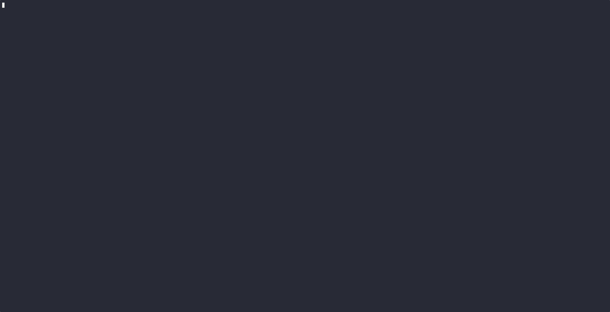

# 🦖 Gradlezilla

**Zero-config, highly-optimized Dockerfiles for Android projects in under 5 seconds.**

Writing and maintaining Dockerfiles for Android CI/CD is notoriously painful. You have to perfectly pin the JDK, Android SDK, Build Tools, Command Line Tools, and NDK versions, or your build crashes. 

Gradlezilla introspects your Android project, extracts the exact toolchain requirements, and generates a production-ready, immutable Docker environment. No Gradle Daemon crashes. No host bleed-through. Just reliable builds.



## 🚀 Installation

The easiest way to install Gradlezilla on macOS or Linux is via Homebrew:

```bash
brew tap kaijutools/tap
brew install gradlezilla
```

*(You can also download the latest pre-compiled binary ZIP from the [Releases](https://github.com/kaijutools/gradlezilla/releases) page).*

## 🛠️ Usage

Navigate to the root of your Android repository and run the `generate` command:

```bash
cd /path/to/your/android/app
gradlezilla generate .
```

Gradlezilla will analyze your `build.gradle` / `build.gradle.kts` files, infer the correct versions, and write a perfectly formatted `Dockerfile` directly to your project root.

### Options & Flags

* **Dry Run:** Preview the generated Dockerfile in your terminal without writing it to disk.
  ```bash
  gradlezilla generate . --dry-run
  # or
  gradlezilla generate . -d
  ```

* **JDK Override:** Gradlezilla attempts to infer your required Java version. For legacy projects that lack a `.java-version` file, you can explicitly force a JDK target to prevent host-environment bleed-through:
  ```bash
  gradlezilla generate . --jdk 17
  ```

## 🏗️ How to Test Your Generated Dockerfile

Once generated, you can test the build environment locally to ensure it successfully compiles your APK:

```bash
# 1. Build the immutable container environment
docker build -t my-android-app-builder .

# 2. Run the container to compile the app (e.g., Debug variant)
docker run --name app-builder my-android-app-builder bash -c "./gradlew assembleDebug --no-daemon"

# 3. Extract the finished APK back to your host machine
docker cp app-builder:/workspace/app/build/outputs/apk/debug ./extracted-apks

# 4. Clean up
docker rm app-builder
```

## 🧠 How it Works (Under the Hood)

Parsing Gradle files with Regex is a fool's errand due to the complexity of the Kotlin DSL and version catalogs. Executing Gradle scripts to extract data is too slow and prone to daemon crashes.

Gradlezilla uses a hybrid **Static Analysis Chain of Responsibility**:
1. **Fast Path (TOML/Properties):** It first looks for declarative version definitions in `libs.versions.toml`, `gradle.properties`, and `.java-version` files.
2. **AST Parsing:** It safely parses `build.gradle.kts` ASTs to find exact `compileSdk`, `buildToolsVersion`, and `ndkVersion` declarations.
3. **Environment Generation:** It synthesizes these requirements into a dynamic `sdkmanager` bash command that installs only what your project strictly requires—nothing more, nothing less.

## 🤝 Contributing

Pull requests are welcome! If Gradlezilla fails to parse a specific repository structure, please open an issue with a link to the public repo or a snippet of the `build.gradle` file.

1. Clone the repository.
2. Build the CLI locally: `./gradlew :cli:installDist`
3. Run your local build: `./cli/build/install/gradlezilla/bin/gradlezilla --help`

## 📄 License

Gradlezilla is released under the [MIT License](LICENSE).