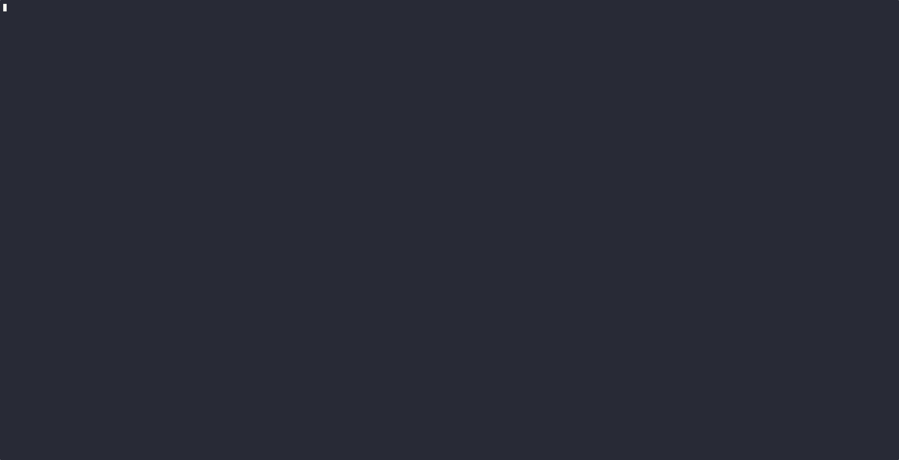

# 🦖 Gradlezilla

**Zero-config, highly-optimized Dockerfiles for Android projects in under 5 seconds.**

Writing and maintaining Dockerfiles for Android CI/CD is notoriously painful. You have to perfectly pin the JDK, Android SDK, Build Tools, Command Line Tools, and NDK versions, or your build crashes. 

Gradlezilla introspects your Android project, extracts the exact toolchain requirements, and generates a production-ready, immutable Docker environment. No Gradle Daemon crashes. No host bleed-through. Just reliable builds.



## 🚀 Installation

The easiest way to install Gradlezilla on macOS or Linux is via Homebrew:

```bash
brew tap kaijutools/tap
brew install gradlezilla
```

*(You can also download the latest pre-compiled binary ZIP from the [Releases](https://github.com/kaijutools/gradlezilla/releases) page).*

## 🛠️ Usage

Navigate to the root of your Android repository and run the `generate` command:

```bash
cd /path/to/your/android/app
gradlezilla generate .
```

Gradlezilla will analyze your `build.gradle` / `build.gradle.kts` files, infer the correct versions, and write a perfectly formatted `Dockerfile` directly to your project root.

### Options & Flags

* **Dry Run:** Preview the generated Dockerfile in your terminal without writing it to disk.
  ```bash
  gradlezilla generate . --dry-run
  # or
  gradlezilla generate . -d
  ```

* **JDK Override:** Gradlezilla attempts to infer your required Java version. For legacy projects that lack a `.java-version` file, you can explicitly force a JDK target to prevent host-environment bleed-through:
  ```bash
  gradlezilla generate . --jdk 17
  ```

## 🏗️ How to Use Your Generated Dockerfile

The generated image is a build **environment**, not a build artifact: it contains the
pinned JDK and Android SDK packages your project needs, and nothing else. Your source
code is never copied into the image — mount your repository in at `/workspace` and run
Gradle there:

```bash
# 1. Build the environment image
docker build -t my-android-env .

# 2. Run Gradle inside it, against your mounted repository
docker run --rm -v "$PWD:/workspace" my-android-env ./gradlew assembleDebug
```

Because the repository is mounted rather than copied, the APK lands directly at
`build/outputs/apk/debug` on your host — no `docker cp` needed. This also means the
image is stable across source-only commits: it only changes when a base version (JDK,
`compileSdk`, build tools, NDK) changes, so it's a good fit for caching in CI.

### GitHub Actions

Use the image directly as the job's `container` — the mount is implicit, since the repo
is already checked out into the workspace:

```yaml
jobs:
  build:
    runs-on: ubuntu-latest
    container: ghcr.io/your-org/my-android-env:latest
    steps:
      - uses: actions/checkout@v6
      - run: ./gradlew assembleDebug --no-daemon
```

## 🧠 How it Works (Under the Hood)

Parsing Gradle files with Regex is a fool's errand due to the complexity of the Kotlin DSL and version catalogs. Executing Gradle scripts to extract data is too slow and prone to daemon crashes.

Gradlezilla uses a hybrid **Static Analysis Chain of Responsibility**:
1. **Fast Path (TOML/Properties):** It first looks for declarative version definitions in `libs.versions.toml`, `gradle.properties`, and `.java-version` files.
2. **AST Parsing:** It safely parses `build.gradle.kts` ASTs to find exact `compileSdk`, `buildToolsVersion`, and `ndkVersion` declarations.
3. **Environment Generation:** It synthesizes these requirements into a dynamic `sdkmanager` bash command that installs only what your project strictly requires—nothing more, nothing less.

## 📊 Matrix Test Status

Results from the latest [Repository Matrix Test](.github/workflows/matrix-test.yaml) run on `main`.

<!-- MATRIX-TABLE:START -->
Last verified at commit [`fdecfe2`](https://github.com/kaijutools/gradlezilla/commit/fdecfe2cfc9b398075250aa608e7186c962739a4).

| Repository | Status |
|---|---|
| Sunflower | ✅ Success |
| Now In Android | ✅ Success |
| Timber | ✅ Success |
| Signal | ✅ Success |
| Wikipedia | ✅ Success |

<!-- MATRIX-TABLE:END -->

## ⚠️ Known Limitations

Gradlezilla runs every Gradle Tooling API connection against an isolated, persistent Gradle
user home (`~/.gradlezilla/gradle-home`, overridable via `GRADLEZILLA_GRADLE_HOME`) so its
daemon never gets mixed up with ones spawned by Android Studio or other projects. The very
first run creates this home and prints a one-line notice to stderr; that run — and any later
run that needs a Gradle distribution it hasn't downloaded yet — will be noticeably slower
while the distribution downloads. Once a given Gradle version has been used once, subsequent
runs against it reuse the cached distribution.

CI users should cache the `GRADLEZILLA_GRADLE_HOME` directory between runs to avoid paying
the warm-up cost on every job.

The init script used for extraction (`extractor.gradle`) targets Gradle 5.0 as its minimum
supported version, matching the floor `GradleJdkCompatibility` already assumes elsewhere in the
codebase. This is verified empirically (not just by API-availability inspection) against a real
Gradle 5.0 distribution as part of the test suite — see `InitScriptGradleVersionCompatTest`. Any
API used in the script that's newer than Gradle 5.0 must stay behind an explicit
`GradleVersion.current() >= ...` guard with a fallback (or a no-op) for older versions; an
unguarded newer API silently breaks extraction for every project on an older Gradle instead of
failing a test.

## 🤝 Contributing

Pull requests are welcome! If Gradlezilla fails to parse a specific repository structure, please open an issue with a link to the public repo or a snippet of the `build.gradle` file.

1. Clone the repository.
2. Build the CLI locally: `./gradlew :cli:installDist`
3. Run your local build: `./cli/build/install/gradlezilla/bin/gradlezilla --help`

## 📄 License

Gradlezilla is released under the [MIT License](LICENSE).